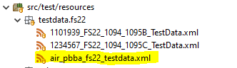
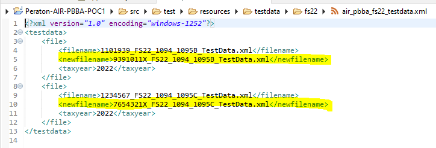
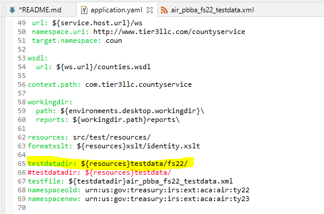

# AIR-PBBA Automation Testing Proof of Concept

## Configuration
ensure you have a directory set up for the current filingseason test data `src/test/resources/testdata/fs22`

create an xml file in that directory that will hold a list of all the test files to be updated to the new filing season

the *newfilename* element should be name the current filingseason test file will be renamed to

open the **application.yaml** file in the `src/main/resources` directory and make sure the *testdatadir* variable matches the filingseason direcotry name set up in step 1

## Execution

pass in the *old filingseason* and the *new filingseason*, and *formType* as parameters on the command line
i.e. `oldFS=fs22, newFS=fs23`

i.e. `formType=electronic` or `formType=refactor` or `formType=1095A` or `formType=paper`
**testRun=electronic** - execute to update files for standard **filing season** testing (1094/1095/B/C)

**testRun=refactor** - execute to update files for **refactor** testing (1094/1095/B/C)

**testRun=1095A** - execute to update files for **1095A** testing

**testRun=paper** - execute to update files for **paper** testing (scrips)

`java -jar target/Peraton-AIR-PBBA-POC1-0.2.0.jar -DoldFS=fs22,-DnewFS=fs23,-DtestRun=electronic, --spring.profiles.active=irs`

`mvn spring-boot:run -Dspring-boot.run.profiles=irs -Dspring-boot.run.arguments=--oldFS=fs22,--newFS=fs23,--testRun=electronic`

## Build lib directory
`mvn dependency:copy-dependencies`

