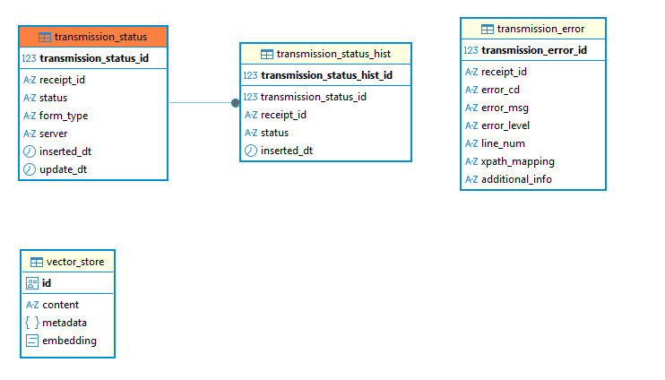
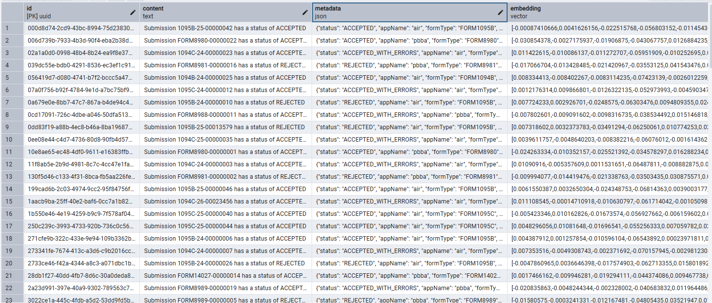
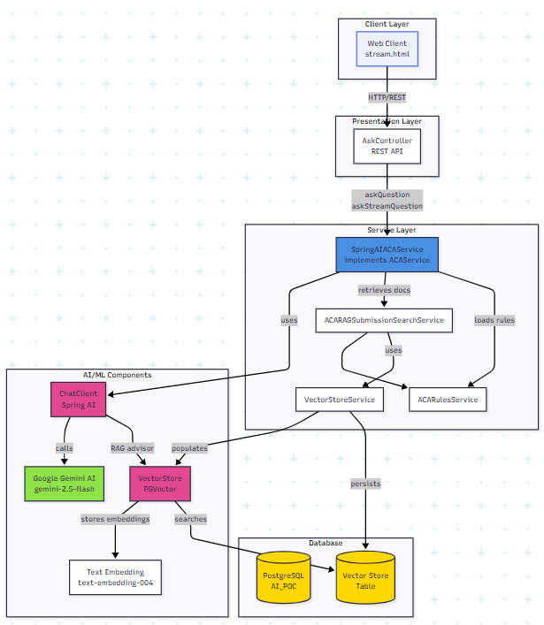

# SPRING AI Proof-of-Concept

A RAG-based AI chatbot that helps users query transmission status and errors using natural language, leveraging Google's Gemini AI 
with vector-based semantic search over transmission data.

---

## 1.0 Use Case  
- Demonstrate capability to use natural language to query IRS AIR and PBBA submissions.
- Train large language model (LLM) on AIR/PBBA submission data.  
- Leverage tools compatible with IRS technology investments.  
- Leverage tools support staff is already familiar with.

---

## 2.0 Tech Stack 
  
| POC Demo | Available at IRS |  
| -------- | ---------------- |  
| Java 17           | :white_check_mark: |  
| Spring Boot 3.5   | :white_check_mark: |  
| Spring 6.2        | :white_check_mark: | 
| Spring AI 1.1     | :ok_hand:          |
| Hibernate 6.6     | :white_check_mark: |   
| PostgreSQL 15   (vector enabled) | :x: Oracle 19   :white_check_mark: Oracle 23+ (vector capable)   :arrow_right: Elasticsearch |  
| Google Gemini     | Open AI |  

---

### 2.1 Spring AI
- An application framework for AI software engineering
- Adresses the fundamental challenge of AI integration: connecting your enterprise data and APIs with AI models
- A client abstraction for working with various AI providers
- Provides an interface that is consistent across all AI providers and their models
- Code is portable no matter what model your application is backed by (i.e OpenAI, Anthropic, Google Gemini, Meta)  

---

### 2.2 Vector Database
- A vector database (or vector store) is a specialized database that efficiently stores and searches high-dimensional numerical representations (vectors) of data, like text, images, or audio, to find semantically similar items quickly.
 - It will take any data you feed it and convert it to a multidimensional numeric array
 - It uses the proximity of these vectors in a mathematical space to conduct similarity searches
 - Spring AI comes with support for several popular vector stores, including Apache Cassandra, Elasticsearch, MongoDB, Oracle, Neo4j, PostgreSQL, and Redis 

---

**POC ERD**   
 

---

**Vector representation of data**
 
 

---

### 2.3 Retrieval Augmented Generation (RAG)  
- RAG is a way to provide relevant information to an LLM on the fly as you are asking questions.
- A *RAG-enabled application* submits queries to the vector store to find documents that are similar (and presumably relevant) to the question.
- :cool: For the purposes on this POC we are literally **training the LLM on our business domain** so it can answer questions about submissions. 

---

### 2.4 POC Architecture  

---

## 3.0 How I Used AI  
- prompt engineering to construct a prompt to generate test data.
  - 100 records (50 air/50 pbba)  
- system architecture diagram generation
- debugging

---
 
## 4.0 Time Investment  
| Activity  | :clock1030: |  
| --------- | ---- |  
| application scaffolding | 4 hours |  
| google set up (google ai & google cloud) | 4 hours |  
| learning Spring AI framework | 3 days |  
| coding the app | 5 days |  

---

## 5.0 Demonstration
:link:[Spring AI POC Demo](http://localhost:8080/ai-poc/stream.html)  

---

## 6.0 Next Steps
- :bulb: ideas 
- **goal 1**: train the model on *test* data  
- **scenario** : have an AI agent execute a set of test cases and analyze the results.   
  -- What is the failure rate?  
  -- What is the most common error?  
  -- What form types have the most/least errors?  
  -- Over time we can perform time-series analysis:  What is the failure rate over time?  Are we improving or regressing?

---
  
- **goal 2**: train the model to analyze *test* submissions  
- **scenario** : upload submission xml/pdf file.  have an AI agent extract the data, then validate the submission based on business rules.  

---

- **goal 3**: document pipeline
- **scenario**: create a event listener to ingest a submission into vector store when an xml/pdf file is written to a directory

---

## 7.0 Reference Documentation
For further reference, please consider the following:

* [Spring AI](https://spring.io/projects/spring-ai)
* [Google GenAI](https://docs.spring.io/spring-ai/reference/api/chat/google-genai-chat.html)
* [Google GenAI Embeddings](https://docs.spring.io/spring-ai/reference/api/embeddings/google-genai-embeddings.html)
* [PDF Document Reader](https://docs.spring.io/spring-ai/reference/api/etl-pipeline.html#_pdf_page)
* [PGvector Vector Database](https://docs.spring.io/spring-ai/reference/api/vectordbs/pgvector.html)

